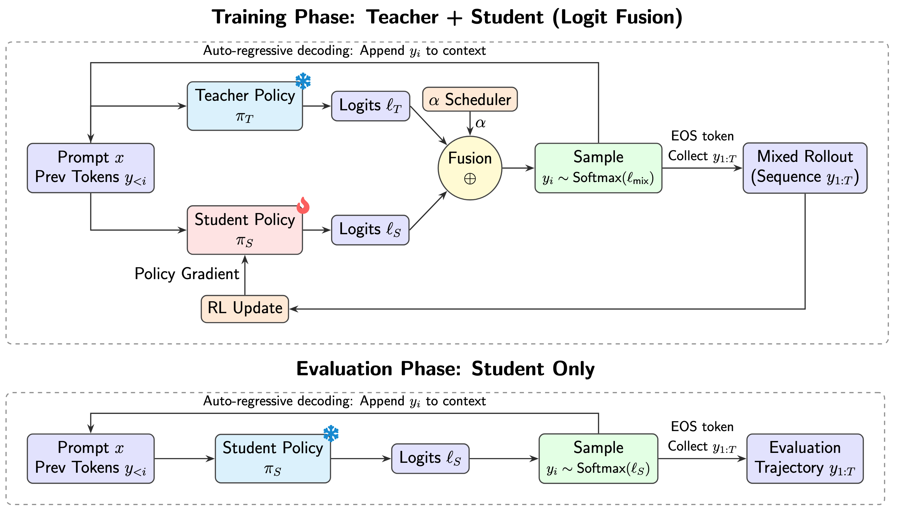

# Logit Fusion for Post-Training LLMs

Official repository for [**Learning from Mixed Rollouts: Logit Fusion as a Bridge Between Imitation and Exploration**](https://juzhengz.notion.site/logit-fusion).

This project studies a hybrid post-training recipe for reasoning models: generate rollouts from a fused teacher-student behavior policy, then optimize the student with RL and off-policy correction.



## Repository Structure

- `examples/scripts/gspo.py`: main training entrypoint used by the provided launch scripts.
- `trl/trainer/grpo_trainer.py`: GRPO trainer implementation with logit-fusion rollout support.
- `trl/trainer/grpo_config.py`: configuration arguments for fusion, IS correction, and clipping.
- `trl/trainer/utils.py`: shared trainer utilities.
- `scripts/`: runnable scripts for logit-fusion experiments and utility scripts.

## Installation

```bash
conda create -n trl python=3.10 -y
conda activate trl
pip install -r requirements.txt
pip install -e .
```

## Quick Start

Run GSPO + logit fusion:

```bash
bash scripts/run_logit_fusion_gspo.sh
```

Run DAPO + logit fusion:

```bash
bash scripts/run_logit_fusion_dapo.sh
```

Example with overrides:

```bash
MODEL_NAME_OR_PATH=Qwen/Qwen2.5-0.5B \
TEACHER_MODEL_NAME_OR_PATH=Qwen/Qwen2.5-7B \
OUTPUT_DIR=outputs/gspo-fusion \
RUN_NAME=gspo-fusion-public \
ALPHA_INIT=0.5 \
ALPHA_DECAY_STEPS=5000 \
REPORT_TO=wandb \
bash scripts/run_logit_fusion_gspo.sh
```

## Available Scripts

#### Main public launchers

- `scripts/run_logit_fusion_gspo.sh`: clean GSPO launcher for fused rollouts.
- `scripts/run_logit_fusion_dapo.sh`: clean DAPO launcher for fused rollouts.

#### Additional experiment launchers

- `scripts/gspo_train_0.5B.sh`
- `scripts/dapo_train_0.5B.sh`
- `scripts/dapo_train_1.5B.sh`
- `scripts/dapo_baseline_0.5B.sh`
- `scripts/dapo_baseline_1.5B.sh`
- `scripts/opd_train.sh`

These scripts are useful references for specific internal experiment settings.

## Acknowledgement

This repository is based on [TRL](https://github.com/huggingface/trl), and extends it with logit-fusion rollouts and related off-policy training components.

## Citation

```bibtex
@article{zhang2026logitfusion,
  title={Learning from Mixed Rollouts: Logit Fusion as a Bridge Between Imitation and Exploration},
  url={https://juzhengz.notion.site/logit-fusion},
  author={Zhang, Juzheng and Hans, Abhimanyu and Kirchenbauer, John and Goldblum, Micah and Panda, Ashwinee and Goldstein, Tom},
  journal={Notion Blog},
  year={2026}
}
```
